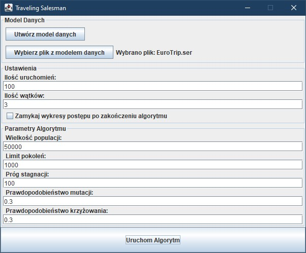

# Algorytmy Ewolucyjne — Rozwiązanie Problemu Komiwojażera

## Opis projektu

Projekt realizuje zastosowanie algorytmów ewolucyjnych do rozwiązania klasycznego problemu komiwojażera (TSP — *Traveling Salesman Problem*). Celem algorytmu jest znalezienie najkrótszej trasy, którą komiwojażer odwiedzi wszystkie miasta dokładnie raz i wróci do punktu początkowego.

Aplikacja została napisana w języku Java z wykorzystaniem biblioteki `Jenetics`, która wspiera implementację algorytmów genetycznych i umożliwia łatwe dostosowanie parametrów optymalizacyjnych.

Szczegóły dotyczące implementacji algorytmu oraz analiza wyników dostępne są w [raporcie projektu](https://github.com/akotu235/algorytmy-ewolucyjne/blob/master/report/report.md).

## Funkcjonalności

- **Generowanie danych wejściowych**: Program automatycznie pobiera współrzędne geograficzne miast i oblicza odległości między nimi, wykorzystując API **Nominatim** oraz **OSRM**.
- **Optymalizacja trasy**: Implementacja algorytmu genetycznego pozwala znaleźć optymalną trasę przejścia przez wszystkie miasta.
- **Elastyczna konfiguracja**: Parametry algorytmu, takie jak wielkość populacji, liczba generacji, prawdopodobieństwo mutacji i krzyżowania, można łatwo konfigurować w graficznym interfejsie użytkownika.
- **Analiza wyników**: Program umożliwia wielokrotne uruchomienie algorytmu i analizę wyników pomocy generowanych wykresów.

## Technologie i narzędzia

- **Java**
- **Biblioteka Jenetics** — do implementacji algorytmu genetycznego
- **Nominatim API** — do pobierania współrzędnych miast
- **OSRM API** — do obliczania odległości tras samochodowych
- **JFreeChart** — do wizualizacji wyników

## Szybki start

### Wymagania wstępne

* Java Development Kit (JDK) w wersji 11 lub wyższej

### Uruchamianie

1. Sklonuj repozytorium:
   ```bash
   git clone https://github.com/akotu235/algorytmy-ewolucyjne.git
   ```

2. Zbuduj projekt za pomocą Mavena:
   ```bash
   ./mvnw clean install
   ```

3. Uruchom aplikacje.
   ```bash
   java -jar ./target/TravelingSalesman-jar-with-dependencies.jar
   ```

### Przygotowanie danych dla algorytmu
1. Otwórz aplikację GUI.
2. W oknie głównym kliknij przycisk `Utwórz model danych`.
3. Wybierz nazwę oraz lokalizację pliku wyjściowego.
4. Wprowadź nazwy miast, oddzielając je przecinkami lub umieszczając każde miasto w nowej linii.
5. Kliknij `Utwórz dane`, aby zapisać plik modelu danych w wybranej lokalizacji. Czas przygotowania danych może zależeć od liczby miast.

### Uruchamianie algorytmu:
1. W oknie głównym programu wybierz plik z modelem danych przygotowany w poprzednim kroku.
2. Dostosuj parametry algorytmu.
3. Kliknij przycisk `Uruchom Algorytm`, aby rozpocząć proces ewolucji. Wyniki zostaną wyświetlone na wykresie.

## Zrzuty ekranu

- Główne okno aplikacji:



- Okno tworzenia modelu danych:


- Przykładowy wykres przedstawiający przebieg ewolucji:


- Przykładowe okno wyświetlające wyniki:


### Licencja
Rozpowszechniane na licencji MIT. Zobacz [LICENSE](https://github.com/akotu235/algorytmy-ewolucyjne/blob/master/LICENSE), aby uzyskać więcej informacji.

[](https://github.com/akotu235/algorytmy-ewolucyjne/blob/master/LICENSE)

### Kontakt
Andrzej – [Zgłoś problem lub zadaj pytanie online](https://akotu235.github.io/)

Link do projektu: [https://github.com/akotu235/algorytmy-ewolucyjne](https://github.com/akotu235/algorytmy-ewolucyjne)