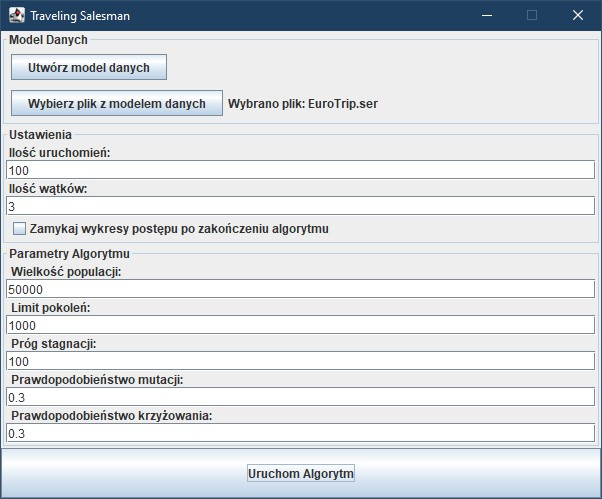
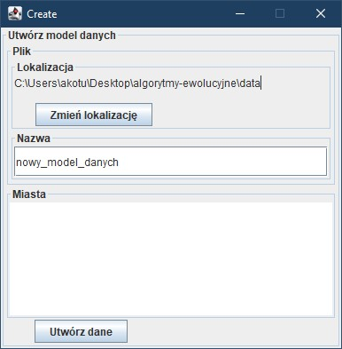

### Sztuczna Inteligencja i Systemy Ekspertowe
# Algorytmy Ewolucyjne
## *Zasada działania, obszary zastosowań, biblioteki programistyczne, zastosowanie do wybranego problemu optymalizacyjnego oraz eksperymenty*
## [**Andrzej Kotulski**](https://akotu235.github.io/)
[**WSZiB**](https://www.wszib.edu.pl/), 2024

---

## 1. Zasada działania i zastosowania
**Algorytm ewolucyjny** (ang.&nbsp;evolutionary algorithm) to&nbsp;metoda optymalizacji inspirowana mechanizmami ewolucji biologicznej, takimi jak dziedziczenie, mutacja, krzyżowanie oraz selekcja naturalna. Algorytm działa na&nbsp;populacji potencjalnych rozwiązań problemu, które są&nbsp;kodowane w&nbsp;formie genotypów (zbiorów cech). Każde rozwiązanie jest oceniane przy użyciu funkcji celu (fitness), która mierzy jego "przystosowanie" w&nbsp;kontekście optymalizacji. Proces ewolucji składa się z&nbsp;kilku kluczowych etapów:

1.	**Inicjalizacja**: Generowanie początkowej populacji rozwiązań.

2. **Ocena**: Każdy osobnik w&nbsp;populacji jest oceniany przy użyciu funkcji fitness, co&nbsp;pozwala ocenić jakość każdego rozwiązania.

3. **Selekcja**: Wybór najlepiej przystosowanych osobników do&nbsp;reprodukcji na&nbsp;podstawie wyników fitness.

4. **Krzyżowanie i mutacja**: Procesy inspirowane biologiczną ewolucją, które tworzą nowe rozwiązania (potomków) poprzez kombinację cech rodziców i&nbsp;losowe zmiany (mutacje).

5. **Zastępowanie**: Nowe rozwiązania zastępują część populacji, a&nbsp;proces jest powtarzany iteracyjnie aż&nbsp;do&nbsp;osiągnięcia zadanych kryteriów zakończenia, np.&nbsp;liczby iteracji lub ustabilizowania się wartości fitness.

Algorytmy ewolucyjne znajdują zastosowanie w&nbsp;wielu dziedzinach. Jednym z&nbsp;ich głównych zastosowań jest sztuczna inteligencja, gdzie algorytmy ewolucyjne są&nbsp;wykorzystywane do&nbsp;trenowania modeli neuronowych (algorytmy neuroewolucji). Dzięki adaptacyjnemu charakterowi mogą one automatycznie optymalizować architekturę sieci neuronowych oraz ich parametry [[1]](#bibliografia).

Kolejnym obszarem jest optymalizacja wielokryterialna, gdzie rozwiązania muszą spełniać wiele, często sprzecznych wymagań. Przykładami takich problemów są optymalizacja zasobów w&nbsp;systemach inżynieryjnych oraz projektowanie efektywnych sieci telekomunikacyjnych [[2]](#bibliografia).

Zastosowanie algorytmów ewolucyjnych w&nbsp;logistyce obejmuje m.in.&nbsp;problemy trasowania pojazdów, optymalizację transportu oraz zarządzanie magazynem. Złożoność tych problemów sprawia, że&nbsp;tradycyjne metody optymalizacyjne są&nbsp;często niewystarczające, a&nbsp;algorytmy inspirowane ewolucją oferują efektywne podejście do&nbsp;ich rozwiązywania [[2, 3]](#bibliografia).

## 2. Biblioteki programistyczne

### 2.1. DEAP (Distributed Evolutionary Algorithms in Python) [[4]](#bibliografia)

**Instalacja**:

`DEAP` jest dostępna poprzez menedżer pakietów Pythona, co&nbsp;umożliwia jej łatwą instalację i&nbsp;integrację z&nbsp;istniejącymi projektami.

**Możliwości**:

`DEAP` oferuje elastyczną platformę do&nbsp;tworzenia algorytmów ewolucyjnych, takich jak:

* Algorytmy genetyczne (`GA`)
* Programowanie genetyczne (`GP`)
* Strategie ewolucyjne (`ES`)
* Algorytmy ewolucji różnicowej (`DE`)

Obsługuje niestandardowe genotypy, funkcje fitness oraz operatory, a&nbsp;także umożliwia wizualizację wyników.

**Zalety**:

* Duża elastyczność w tworzeniu algorytmów.
* Wsparcie dla wielu typów algorytmów.
* Możliwości optymalizacji wielokryterialnej.

**Wady**:

* Krzywa uczenia się dla początkujących.
* Potencjalnie wolniejsza wydajność przy dużych populacjach.

### 2.2. Jenetics (Java) [[5]](#bibliografia)

**Instalacja**:

`Jenetics` można zainstalować, dodając odpowiednią zależność do&nbsp;pliku konfiguracyjnego projektu opartego na&nbsp;Mavenie lub Gradle, co&nbsp;ułatwia zarządzanie biblioteką i&nbsp;jej wersjami w&nbsp;środowisku Java.

**Możliwości**:

`Jenetics` umożliwia implementację algorytmów genetycznych z&nbsp;prostym API, oferując wsparcie dla:

* Algorytmów genetycznych (`GA`)
* Algorytmów ewolucji różnicowej (`DE`)
* Algorytmów wielokryterialnych (`NSGA-II`, `SPEA2`)

Obsługuje paralelizację, co&nbsp;zwiększa wydajność.

**Zalety**:

* Wydajność i skalowalność.
* Proste i intuicyjne API.
* Wsparcie dla równoległego przetwarzania.

**Wady**:

* Skupiona głównie na algorytmach genetycznych.

## 3. Zaimplementowany algorytm rozwiązujący wybrany problem optymalizacyjny

**Wybrany problem**: 
Problem komiwojażera

**Opis problemu**: 
Problem komiwojażera polega na znalezieniu najkrótszej trasy, którą komiwojażer odwiedzi każde miasto dokładnie raz i&nbsp;wróci do&nbsp;punktu początkowego. Jest to&nbsp;klasyczny problem optymalizacyjny, w&nbsp;którym poszukuje się minimalnej długości trasy.

**Algorytm**: 
Algorytm genetyczny z&nbsp;użyciem biblioteki `Jenetics`

**Przygotowanie danych**:
Aby dostarczyć algorytmowi genetycznemu odpowiednie dane wejściowe, generowany jest obiekt `DataModel`, zawierający informacje o&nbsp;miastach i&nbsp;kosztach tras między nimi. Proces przygotowania danych obejmuje następujące kroki:

1. **Pobieranie nazw miast**:
Program przyjmuje listę nazw miast, która będzie służyła jako punkty docelowe w&nbsp;problemie komiwojażera.

2. **Pobieranie współrzędnych geograficznych**:
Dla każdego miasta program pobiera współrzędne geograficzne (szerokość i&nbsp;długość geograficzną) za&nbsp;pomocą `API Nominatim` [[7]](#bibliografia). Współrzędne te&nbsp;pozwalają na&nbsp;dokładne określenie położenia miast, co&nbsp;jest wymagane do wyznaczania odległości między nimi.

3. **Obliczanie kosztów tras między miastami**:
Na podstawie pobranych współrzędnych każdej pary miast wyznaczany jest koszt trasy (długość drogi samochodowej) z&nbsp;wykorzystaniem `API OSRM` [[8]](#bibliografia). Koszty te&nbsp;są&nbsp;następnie zapisywane w&nbsp;postaci macierzy kosztów (`costMatrix`), gdzie każda komórka określa koszt przejścia między dwoma węzłami (miastami). Macierz jest symetryczna, ponieważ przyjmuje się, że&nbsp;koszt trasy między dwoma miastami jest identyczny w&nbsp;obu kierunkach.

4. **Budowanie modelu danych**:
Powstały obiekt `DataModel` zawiera trzy kluczowe elementy:
   * `nodes` — listę miast (węzłów), reprezentujących poszczególne lokalizacje.
   * `costMatrix` — macierz kosztów tras między miastami.
   * `costUnit` — jednostkę kosztu, która może być kilometrami lub milami, zależnie od&nbsp;ustawień `API OSRM`.

5. **Zapis danych do pliku**:
Obiekt `DataModel` jest zapisywany do&nbsp;pliku, który wczytany jest przez aplikację z&nbsp;algorytmem genetycznym. Dzięki temu proces przygotowania danych może być wykonany jednorazowo, a&nbsp;algorytm uruchamiany wielokrotnie bez konieczności ponownego pobierania i&nbsp;przetwarzania danych.

**Pseudokod**:

1. **Inicjalizacja**
    * Wczytaj dane dla algorytmu `DataModel`
    * Utwórz populację początkową genotypów (ścieżek) o&nbsp;rozmiarze `POPULATION_SIZE`.
    * Każdy genotyp to&nbsp;permutacja miast.

2. **Definicja funkcji oceny (fitness)**
   * Dla każdej ścieżki (genotypu) oblicz jej długość:
     * Sumuj odległości między kolejnymi miastami w&nbsp;ścieżce. 
     * Dodaj odległość powrotu do&nbsp;miasta początkowego. 
   * Wynikowa długość jest wartością fitness (im&nbsp;mniejsza, tym lepiej).

3. **Ewolucja populacji**
   * Powtórz, aż&nbsp;spełnione zostanie kryterium stopu (np.&nbsp;limit generacji lub stabilizacja fitnessu):
     * **Wybierz** osobniki do&nbsp;krzyżowania.
     * **Rekombinacja (crossover)**: dla wybranych par rodziców zastosuj operator PMX, by&nbsp;wymienić fragmenty ich genotypów i&nbsp;uzyskać nowe potomstwo.
     * **Mutacja**: dla każdego potomka, z&nbsp;prawdopodobieństwem `MUTATION_PROBABILITY`, zamień dwa losowo wybrane miasta w&nbsp;trasie.
     * **Zastąp** starą populację osobnikami wybranymi na&nbsp;podstawie ich fitnessu.

4. **Aktualizacja najlepszych wyników**
   * Zapisz i&nbsp;wyświetl najlepszą ścieżkę (trasę) w&nbsp;każdej generacji.
   * Aktualizuj wykres.

5. **Zakończenie**
   * Wyświetl ostateczne rozwiązanie — najlepszą znalezioną trasę i&nbsp;jej długość.
   * Zapisz wykres do&nbsp;pliku.

   
**Szczegóły implementacji**:

1. **Reprezentacja rozwiązania**:
Genotyp osobnika stanowi permutację miast, która odzwierciedla kolejność ich odwiedzin. Z&nbsp;kolei chromosom odnosi się do&nbsp;pełnej ścieżki, czyli całkowitej trasy, jaką ma&nbsp;pokonać komiwojażer.

2. **Parametry algorytmu**: 
Parametry są&nbsp;zdefiniowane w&nbsp;klasie `GeneticAlgorithmConfig`, co&nbsp;ułatwia ich modyfikację i&nbsp;zarządzanie ustawieniami algorytmu.

   **Parametry**:

   * **Wielkość populacji** (`POPULATION_SIZE`) - Liczba osobników w&nbsp;populacji; większa populacja sprzyja różnorodności rozwiązań, ale wydłuża czas obliczeń.

   * **Limit pokoleń** (`GENERATION_LIMIT`) - Maksymalna liczba generacji, po&nbsp;której algorytm kończy działanie, co&nbsp;pozwala kontrolować czas obliczeń przy bardziej czasochłonnych zadaniach.

   * **Próg stagnacji** (`STEADY_FITNESS_GENERATION_LIMIT`) - Liczba generacji, po&nbsp;której algorytm kończy działanie, jeśli wartości fitness pozostają bez poprawy. Umożliwia to&nbsp;wcześniejsze zakończenie poszukiwań, gdy algorytm nie znajduje lepszych rozwiązań.

   * **Prawdopodobieństwo mutacji** (`MUTATION_PROBABILITY`) - Prawdopodobieństwo mutacji dla każdego osobnika w&nbsp;populacji, co&nbsp;zwiększa różnorodność i&nbsp;zapobiega stagnacji w&nbsp;poszukiwaniu rozwiązań.

   * **Prawdopodobieństwo krzyżowania** (`PMX_CROSSOVER_PROBABILITY`) - Prawdopodobieństwo użycia operatora krzyżowania PMX (*Partially Matched Crossover*) podczas tworzenia nowego pokolenia. Operator krzyżowania umożliwia wymianę genotypów między osobnikami, co&nbsp;jest kluczowe dla uzyskania lepszych rozwiązań.

3. **Operatorzy genetyczni**:
   * **Mutacja**: Operator `SwapMutator`, który losowo zamienia kolejność miast w&nbsp;ścieżce.
   * **Krzyżowanie**: Operator `PartiallyMatchedCrossover` (PMX), który pozwala na&nbsp;wymianę fragmentów genotypów między osobnikami.

4. **Funkcja oceny fitness**: 
Funkcja ta&nbsp;służy do&nbsp;oceny uzyskanych rozwiązań na&nbsp;podstawie długości trasy. Oblicza całkowitą odległość, sumując odległości między kolejnymi miastami oraz uwzględniając powrót do&nbsp;miasta początkowego. Dzięki temu możliwe jest porównanie efektywności różnych tras i&nbsp;wybranie najlepszej.

5. **Wizualizacja**:
Do&nbsp;wizualizacji przebiegu ewolucji zastosowano bibliotekę `JFreeChart` [[6]](#bibliografia), która umożliwia dynamiczne monitorowanie postępów algorytmu w&nbsp;czasie rzeczywistym. Wykresy ukazują zmiany wartości fitness najlepszych rozwiązań w&nbsp;kolejnych generacjach, a&nbsp;także wartości najgorsze oraz średnie dla całej generacji, co&nbsp;ułatwia ocenę efektywności algorytmu.

6. **Wykonanie algorytmu**: 
Algorytm działa w&nbsp;oddzielnym wątku, który wyznacza najlepsze rozwiązanie w&nbsp;każdej generacji i&nbsp;aktualizuje wykres w&nbsp;interfejsie graficznym. Po&nbsp;zakończeniu ewolucji algorytm zapisuje wykres do&nbsp;pliku oraz wyświetla najlepsze znalezione rozwiązanie.

7. **Interfejs użytkownika**:  
Prosty i&nbsp;funkcjonalny interfejs, stworzony przy użyciu biblioteki `Swing` [[9]](#bibliografia), pozwalający na&nbsp;konfigurację parametrów i&nbsp;uruchamianie algorytmu ewolucyjnego oraz na&nbsp;generowanie i&nbsp;ładowanie modelu danych.

   * **Panel główny** — zawiera sekcje:
      * **Model danych** — z&nbsp;dwoma przyciskami:
         * **Utwórz model danych** — otwiera panel, który umożliwia tworzenie modelu danych.
         * **Wczytaj dane** — pozwala wybrać plik z&nbsp;zapisanym modelem danych.
      * **Parametry algorytmu** — sekcja umożliwiająca ustawienie wartości parametrów algorytmu.
      * **Przycisk uruchamiania algorytmu** — aktywny po&nbsp;załadowaniu pliku z&nbsp;modelem danych, pozwala uruchomić algorytm.

     

   * **Panel tworzenia modelu danych** — zaprojektowany do&nbsp;generowania nowego modelu danych, podzielony na&nbsp;następujące sekcje:
      * **Plik** — umożliwia wybór lokalizacji oraz nadanie nazwy pliku, w&nbsp;którym zapisany zostanie model.
      * **Miasta** — zawiera pole tekstowe do&nbsp;wprowadzania listy miast, które można oddzielać za&nbsp;pomocą *przecinków* lub *znaków nowej linii*.

     

## 4. Wyniki eksperymentów

*[wartości parametrów algorytmu ustawiane dla poszczególnych eksperymentów, jeżeli różnią się od tych podanych w sekcji 3, skomentowane wykresy pokazujące średnie wyniki z odchyleniami standardowymi z co najmniej 10 uruchomień algorytmu (wykresy powinny pokazywać: najlepszy, najgorszy i średni fitness w populacji w trakcie trwania eksperymentu), omówienie najlepszego znalezionego rozwiązania.]*

## 5. Podsumowanie

*[podsumowanie rezultatów projektu oraz uzyskanych wyników eksperymentów]*

## Bibliografia

1. **K. O. Stanley i R. Miikkulainen, Evolving Neural Networks through Augmenting Topologies**, MIT Press, 2002. 

2. **J. H. Holland, Adaptation in Natural and Artificial Systems: An&nbsp;Introductory Analysis with Applications to&nbsp;Biology, Control, and Artificial Intelligence**, MIT Press, 1992. 

3. **D. E. Goldberg, Genetic Algorithms in&nbsp;Search, Optimization, and&nbsp;Machine Learning**, Addison-Wesley, 1989.

4. **DEAP: Distributed Evolutionary Algorithms in Python**. Dostępne online: <https://deap.readthedocs.io/en/master>.

5. **Jenetics: Biblioteka algorytmu genetycznego w Java**. Dostępne online: <https://jenetics.io>.

6. **JFreeChart: Biblioteka do tworzenia wykresów w Java**. Dostępne online: <http://www.jfree.org/jfreechart>.

7. **OpenStreetMap Nominatim, Dokumentacja API**. Dostępne online: <https://nominatim.org/release-docs/develop/api/Search>.

8. **OSRM Project, Dokumentacja API Open Source Routing Machine**. Dostępne online: <http://project-osrm.org/docs/v5.23.0/api>.

9. **Oracle, Java Swing Tutorial**. Dostępne online: <https://docs.oracle.com/javase/tutorial/uiswing>.

## Załączniki

1. **Repozytorium kodu źródłowego** – Pełny kod projektu. Dostępne online: <https://github.com/akotu235/algorytmy-ewolucyjne>.

2. **Wersja online sprawozdania** – Bieżąca wersja dokumentu. Dostępne online: <https://github.com/akotu235/algorytmy-ewolucyjne/blob/master/report.md>.