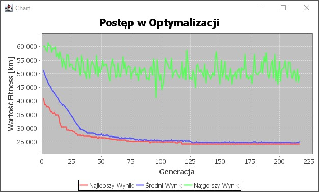
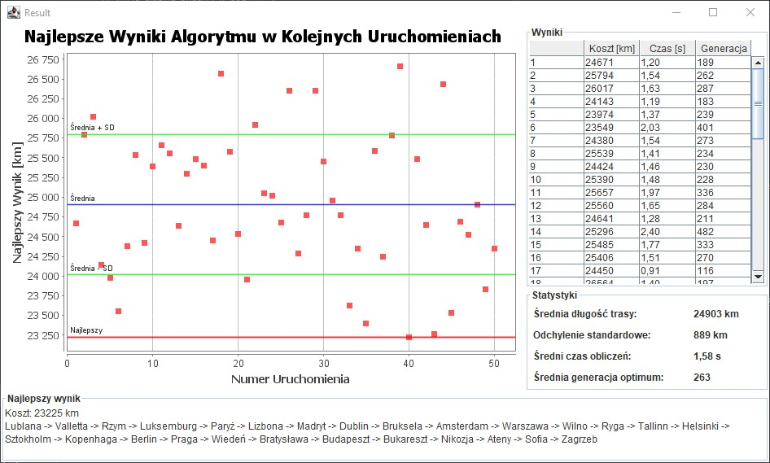

### Sztuczna Inteligencja i Systemy Ekspertowe
# Algorytmy Ewolucyjne
## *Zasada działania, obszary zastosowań, biblioteki programistyczne, zastosowanie do wybranego problemu optymalizacyjnego oraz eksperymenty*
## [**Andrzej Kotulski**](https://akotu235.github.io/)
[**WSZiB**](https://www.wszib.edu.pl/), 2024

---

## 1. Zasada działania i zastosowania
**Algorytm ewolucyjny** (ang.&nbsp;evolutionary algorithm) to&nbsp;metoda optymalizacji inspirowana mechanizmami ewolucji biologicznej, takimi jak dziedziczenie, mutacja, krzyżowanie oraz selekcja naturalna. Algorytm działa na&nbsp;populacji potencjalnych rozwiązań problemu, które są&nbsp;kodowane w&nbsp;formie genotypów (zbiorów cech). Każde rozwiązanie jest oceniane przy użyciu funkcji celu (fitness), która mierzy jego "przystosowanie" w&nbsp;kontekście optymalizacji. Proces ewolucji składa się z&nbsp;kilku kluczowych etapów:

1.	**Inicjalizacja**: Generowanie początkowej populacji rozwiązań.

2. **Ocena**: Każdy osobnik w&nbsp;populacji jest oceniany przy użyciu funkcji fitness, co&nbsp;pozwala ocenić jakość każdego rozwiązania.

3. **Selekcja**: Wybór najlepiej przystosowanych osobników do&nbsp;reprodukcji na&nbsp;podstawie wyników fitness.

4. **Krzyżowanie i mutacja**: Procesy inspirowane biologiczną ewolucją, które tworzą nowe rozwiązania (potomków) poprzez kombinację cech rodziców i&nbsp;losowe zmiany (mutacje).

5. **Zastępowanie**: Nowe rozwiązania zastępują część populacji, a&nbsp;proces jest powtarzany iteracyjnie aż&nbsp;do&nbsp;osiągnięcia zadanych kryteriów zakończenia, np.&nbsp;liczby iteracji lub ustabilizowania się wartości fitness.

Algorytmy ewolucyjne znajdują zastosowanie w&nbsp;wielu dziedzinach. Jednym z&nbsp;ich głównych zastosowań jest sztuczna inteligencja, gdzie algorytmy ewolucyjne są&nbsp;wykorzystywane do&nbsp;trenowania modeli neuronowych (algorytmy neuroewolucji). Dzięki adaptacyjnemu charakterowi mogą one automatycznie optymalizować architekturę sieci neuronowych oraz ich parametry [[1]](#bibliografia).

Kolejnym obszarem jest optymalizacja wielokryterialna, gdzie rozwiązania muszą spełniać wiele, często sprzecznych wymagań. Przykładami takich problemów są optymalizacja zasobów w&nbsp;systemach inżynieryjnych oraz projektowanie efektywnych sieci telekomunikacyjnych [[2]](#bibliografia).

Zastosowanie algorytmów ewolucyjnych w&nbsp;logistyce obejmuje m.in.&nbsp;problemy trasowania pojazdów, optymalizację transportu oraz zarządzanie magazynem. Złożoność tych problemów sprawia, że&nbsp;tradycyjne metody optymalizacyjne są&nbsp;często niewystarczające, a&nbsp;algorytmy inspirowane ewolucją oferują efektywne podejście do&nbsp;ich rozwiązywania [[2, 3]](#bibliografia).

## 2. Biblioteki programistyczne

### 2.1. DEAP (Distributed Evolutionary Algorithms in Python) [[4]](#bibliografia)

**Instalacja**:

`DEAP` jest dostępna poprzez menedżer pakietów Pythona, co&nbsp;umożliwia jej łatwą instalację i&nbsp;integrację z&nbsp;istniejącymi projektami.

**Możliwości**:

`DEAP` oferuje elastyczną platformę do&nbsp;tworzenia algorytmów ewolucyjnych, takich jak:

* Algorytmy genetyczne (`GA`)
* Programowanie genetyczne (`GP`)
* Strategie ewolucyjne (`ES`)
* Algorytmy ewolucji różnicowej (`DE`)

Obsługuje niestandardowe genotypy, funkcje fitness oraz operatory, a&nbsp;także umożliwia wizualizację wyników.

**Zalety**:

* Duża elastyczność w tworzeniu algorytmów.
* Wsparcie dla wielu typów algorytmów.
* Możliwości optymalizacji wielokryterialnej.

**Wady**:

* Krzywa uczenia się dla początkujących.
* Potencjalnie wolniejsza wydajność przy dużych populacjach.

### 2.2. Jenetics (Java) [[5]](#bibliografia)

**Instalacja**:

`Jenetics` można zainstalować, dodając odpowiednią zależność do&nbsp;pliku konfiguracyjnego projektu opartego na&nbsp;Mavenie lub Gradle, co&nbsp;ułatwia zarządzanie biblioteką i&nbsp;jej wersjami w&nbsp;środowisku Java.

**Możliwości**:

`Jenetics` umożliwia implementację algorytmów genetycznych z&nbsp;prostym API, oferując wsparcie dla:

* Algorytmów genetycznych (`GA`)
* Algorytmów ewolucji różnicowej (`DE`)
* Algorytmów wielokryterialnych (`NSGA-II`, `SPEA2`)

Obsługuje paralelizację, co&nbsp;zwiększa wydajność.

**Zalety**:

* Wydajność i skalowalność.
* Proste i intuicyjne API.
* Wsparcie dla równoległego przetwarzania.

**Wady**:

* Skupiona głównie na algorytmach genetycznych.

## 3. Zaimplementowany algorytm rozwiązujący wybrany problem optymalizacyjny

**Wybrany problem**: 
Problem komiwojażera

**Opis problemu**: 
Problem komiwojażera polega na znalezieniu najkrótszej trasy, którą komiwojażer odwiedzi każde miasto dokładnie raz i&nbsp;wróci do&nbsp;punktu początkowego. Jest to&nbsp;klasyczny problem optymalizacyjny, w&nbsp;którym poszukuje się minimalnej długości trasy.

**Algorytm**: 
Algorytm genetyczny z&nbsp;użyciem biblioteki `Jenetics`

### Przygotowanie danych:
Aby dostarczyć algorytmowi genetycznemu odpowiednie dane wejściowe, generowany jest obiekt `DataModel`, zawierający informacje o&nbsp;miastach i&nbsp;kosztach tras między nimi. Proces przygotowania danych obejmuje następujące kroki:

1. **Pobieranie nazw miast**:
Program przyjmuje listę nazw miast, która będzie służyła jako punkty docelowe w&nbsp;problemie komiwojażera.

2. **Pobieranie współrzędnych geograficznych**:
Dla każdego miasta program pobiera współrzędne geograficzne (szerokość i&nbsp;długość geograficzną) za&nbsp;pomocą `API Nominatim` [[7]](#bibliografia). Współrzędne te&nbsp;pozwalają na&nbsp;dokładne określenie położenia miast, co&nbsp;jest wymagane do wyznaczania odległości między nimi.

3. **Obliczanie kosztów tras między miastami**:
Na podstawie pobranych współrzędnych każdej pary miast wyznaczany jest koszt trasy (długość drogi samochodowej) z&nbsp;wykorzystaniem `API OSRM` [[8]](#bibliografia). Koszty te&nbsp;są&nbsp;następnie zapisywane w&nbsp;postaci macierzy kosztów (`costMatrix`), gdzie każda komórka określa koszt przejścia między dwoma węzłami (miastami). Macierz jest symetryczna, ponieważ przyjmuje się, że&nbsp;koszt trasy między dwoma miastami jest identyczny w&nbsp;obu kierunkach.

4. **Budowanie modelu danych**:
Powstały obiekt `DataModel` zawiera trzy kluczowe elementy:
   * `nodes` — listę miast (węzłów), reprezentujących poszczególne lokalizacje.
   * `costMatrix` — macierz kosztów tras między miastami.
   * `costUnit` — jednostkę kosztu, która może być kilometrami lub milami, zależnie od&nbsp;ustawień `API OSRM`.

5. **Zapis danych do pliku**:
Obiekt `DataModel` jest zapisywany do&nbsp;pliku, który wczytany jest przez aplikację z&nbsp;algorytmem genetycznym. Dzięki temu proces przygotowania danych może być wykonany jednorazowo, a&nbsp;algorytm uruchamiany wielokrotnie bez konieczności ponownego pobierania i&nbsp;przetwarzania danych.

### Pseudokod:

1. **Inicjalizacja**
    * Wczytaj dane dla algorytmu `DataModel`
    * Utwórz populację początkową genotypów (ścieżek) o&nbsp;rozmiarze `populationSize`.
    * Każdy genotyp to&nbsp;permutacja miast.

2. **Definicja funkcji oceny (fitness)**
   * Dla każdej ścieżki (genotypu) oblicz jej długość:
     * Sumuj odległości między kolejnymi miastami w&nbsp;ścieżce. 
     * Dodaj odległość powrotu do&nbsp;miasta początkowego. 
   * Wynikowa długość jest wartością fitness (im&nbsp;mniejsza, tym lepiej).

3. **Ewolucja populacji**
   * Powtórz, aż&nbsp;spełnione zostanie kryterium stopu (np.&nbsp;limit generacji lub stabilizacja fitnessu):
     * **Wybierz** osobniki do&nbsp;krzyżowania.
     * **Rekombinacja (crossover)**: dla wybranych par rodziców zastosuj operator PMX, by&nbsp;wymienić fragmenty ich genotypów i&nbsp;uzyskać nowe potomstwo.
     * **Mutacja**: dla każdego potomka, z&nbsp;prawdopodobieństwem `mutationProbability`, zamień dwa losowo wybrane miasta w&nbsp;trasie.
     * **Zastąp** starą populację osobnikami wybranymi na&nbsp;podstawie ich fitnessu.

4. **Zakończenie**
   * Wyświetl ostateczne rozwiązanie — najlepszą znalezioną trasę i&nbsp;jej długość.

### Szczegóły implementacji:

1. **Reprezentacja rozwiązania**:
Genotyp osobnika stanowi permutację miast, która odzwierciedla kolejność ich odwiedzin. Z&nbsp;kolei chromosom odnosi się do&nbsp;pełnej ścieżki, czyli całkowitej trasy, jaką ma&nbsp;pokonać komiwojażer.

2. **Parametry algorytmu**: 
Parametry są&nbsp;zdefiniowane w&nbsp;klasie `GeneticAlgorithmConfig`, co&nbsp;ułatwia ich modyfikację i&nbsp;zarządzanie ustawieniami algorytmu.

   **Parametry**:

   * **Ilość uruchomień** (`executionCount`) - Liczba wielokrotnych uruchomień algorytmu, co umożliwia analizę stabilności wyników i ocenę ich średnich wartości. Większa liczba uruchomień poprawia dokładność oceny wyników, ale wydłuża czas obliczeń.
   
   * **Liczba wątków** (`threadPoolSize`) - Określa liczbę wątków używanych do równoległego przetwarzania obliczeń algorytmu, co przyspiesza czas obliczeń przy odpowiednich zasobach sprzętowych.

   * **Wielkość populacji** (`populationSize`) - Liczba osobników w&nbsp;populacji; większa populacja sprzyja różnorodności rozwiązań, ale wydłuża czas obliczeń.

   * **Limit pokoleń** (`generationLimit`) - Maksymalna liczba generacji, po&nbsp;której algorytm kończy działanie, co&nbsp;pozwala kontrolować czas obliczeń przy bardziej czasochłonnych zadaniach.

   * **Próg stagnacji** (`steadyFitnessGenerationLimit`) - Liczba generacji, po&nbsp;której algorytm kończy działanie, jeśli wartości fitness pozostają bez poprawy. Umożliwia to&nbsp;wcześniejsze zakończenie poszukiwań, gdy algorytm nie znajduje lepszych rozwiązań.

   * **Prawdopodobieństwo mutacji** (`mutationProbability`) - Prawdopodobieństwo mutacji dla każdego osobnika w&nbsp;populacji, co&nbsp;zwiększa różnorodność i&nbsp;zapobiega stagnacji w&nbsp;poszukiwaniu rozwiązań.

   * **Prawdopodobieństwo krzyżowania** (`crossoverProbability`) - Prawdopodobieństwo użycia operatora krzyżowania PMX (*Partially Matched Crossover*) podczas tworzenia nowego pokolenia. Operator krzyżowania umożliwia wymianę genotypów między osobnikami, co&nbsp;jest kluczowe dla uzyskania lepszych rozwiązań.

3. **Operatorzy genetyczni**:
   * **Mutacja**: Operator `SwapMutator`, który losowo zamienia kolejność miast w&nbsp;ścieżce.
   * **Krzyżowanie**: Operator `PartiallyMatchedCrossover` (PMX), który pozwala na&nbsp;wymianę fragmentów genotypów między osobnikami.

4. **Funkcja oceny fitness**: 
Funkcja ta&nbsp;służy do&nbsp;oceny uzyskanych rozwiązań na&nbsp;podstawie długości trasy. Oblicza całkowitą odległość, sumując odległości między kolejnymi miastami oraz uwzględniając powrót do&nbsp;miasta początkowego. Dzięki temu możliwe jest porównanie efektywności różnych tras i&nbsp;wybranie najlepszej.

5. **Wizualizacja**:
Do&nbsp;wizualizacji przebiegu ewolucji zastosowano bibliotekę `JFreeChart` [[6]](#bibliografia), która umożliwia dynamiczne monitorowanie postępów algorytmu w&nbsp;czasie rzeczywistym. Wykresy ukazują zmiany wartości fitness najlepszych rozwiązań w&nbsp;kolejnych generacjach, a&nbsp;także wartości najgorsze oraz średnie dla całej generacji, co&nbsp;ułatwia ocenę efektywności algorytmu.

6. **Wykonanie algorytmu**: 
Algorytm działa w&nbsp;oddzielnym wątku, który wyznacza najlepsze rozwiązanie w&nbsp;każdej generacji i&nbsp;aktualizuje wykres w&nbsp;interfejsie graficznym. Po&nbsp;zakończeniu ewolucji algorytm wyświetla najlepsze znalezione rozwiązanie.

7. **Interfejs użytkownika**:  
Prosty i&nbsp;funkcjonalny interfejs, stworzony przy użyciu biblioteki `Swing` [[9]](#bibliografia), pozwalający na&nbsp;konfigurację parametrów i&nbsp;uruchamianie algorytmu ewolucyjnego oraz na&nbsp;generowanie i&nbsp;ładowanie modelu danych.

   * **Panel główny** — zawiera sekcje:
      * **Model danych** — z&nbsp;dwoma przyciskami:
         * **Utwórz model danych** — otwiera panel, który umożliwia tworzenie modelu danych.
         * **Wczytaj dane** — pozwala wybrać plik z&nbsp;zapisanym modelem danych.
      * **Ustawienia** — pozwalają użytkownikowi dostosować opcje dotyczące działania algorytmu.
      * **Parametry algorytmu** — sekcja umożliwiająca ustawienie wartości parametrów algorytmu.
      * **Przycisk uruchamiania algorytmu** — aktywny po&nbsp;załadowaniu pliku z&nbsp;modelem danych, pozwala uruchomić algorytm.

    

   * **Panel tworzenia modelu danych** — zaprojektowany do&nbsp;generowania nowego modelu danych, podzielony na&nbsp;następujące sekcje:
      * **Plik** — umożliwia wybór lokalizacji oraz nadanie nazwy pliku, w&nbsp;którym zapisany zostanie model.
      * **Miasta** — zawiera pole tekstowe do&nbsp;wprowadzania listy miast, które można oddzielać za&nbsp;pomocą *przecinków* lub *znaków nowej linii*.

    

## 4. Wyniki eksperymentów

### Cele eksperymentów:

Eksperymenty mają na&nbsp;celu ocenę skuteczności algorytmu w&nbsp;rozwiązywaniu problemu komiwojażera, a&nbsp;także analizę wpływu parametrów algorytmu oraz danych wejściowych na&nbsp;jakość wyników i&nbsp;czas obliczeń.

### Przygotowanie eksperymentów:

**Zbiór danych**:

W celu przeprowadzenia eksperymentów przygotowano trzy różne zestawy danych, reprezentujące miasta i&nbsp;odległości pomiędzy nimi. Zestawy różnią się rozmiarem, aby umożliwić analizę wpływu wielkości problemu na&nbsp;wyniki algorytmu genetycznego. Poniżej opisano poszczególne zestawy:

* **Zestaw 1 (10 miast):**

    Niewielki zbiór danych zawierający 10 miast. Zestaw ten pozwala na&nbsp;szybkie przeprowadzenie eksperymentów i&nbsp;porównanie wyników z&nbsp;optymalnym rozwiązaniem uzyskanym metodami wyczerpującymi.
    **Liczba możliwych tras:** $(10-1)! = 9! = 362\,880$.

* **Zestaw 2 (27 miast):**

    Średniej wielkości zbiór danych składający się z&nbsp;27 miast. Jest to&nbsp;bardziej złożony problem, w&nbsp;którym liczba możliwych tras znacznie wzrasta, co&nbsp;utrudnia zastosowanie algorytmów deterministycznych.
    **Liczba możliwych tras:** $(27-1)! = 26! \approx 4,032 \times 10^{26}$.

* **Zestaw 3 (100 miast):**

    Duży zbiór danych, który zawiera 100 miast. Przy takiej liczbie elementów problem staje się praktycznie nierozwiązywalny dla metod wyczerpujących, co&nbsp;stanowi wyzwanie dla algorytmów genetycznych.
    **Liczba możliwych tras:** $(100-1)! = 99! \approx 9,33 \times 10^{155}$.

**Parametry algorytmu ewolucyjnego**:

Każdy eksperyment prowadzono z&nbsp;różnymi wartościami parametrów, co&nbsp;umożliwiło ocenę wpływu każdej z&nbsp;tych zmiennych na efektywność oraz czas działania algorytmu.

**Środowisko sprzętowe**:

Eksperymenty uruchamiano na komputerze z procesorem wielordzeniowym, co&nbsp;pozwoliło na równoległe przetwarzanie, przydzielając różne ilości wątków (`threadPoolSize`) dla algorytmu, aby ocenić wpływ równoległości na&nbsp;czas wykonania.

### **Eksperyment 1** — Badanie wpływu wielkości populacji na efektywność algorytmu genetycznego

**Cel eksperymentu**:

Celem eksperymentu było zbadanie, jak zmiana parametru określającego wielkość populacji (`populationSize`) wpływa na&nbsp;jakość rozwiązania oraz czas wykonania algorytmu genetycznego. Eksperyment miał na&nbsp;celu zrozumienie, jak liczba osobników w&nbsp;populacji wpływa na&nbsp;efektywność algorytmu, zarówno pod względem jakości rozwiązania, jak i&nbsp;jego wydajności.

**Założenia eksperymentu**:

Eksperyment przeprowadzono na&nbsp;najmniejszym dostępnym zestawie danych, który zawierał 10 miast. Pozostałe parametry algorytmu genetycznego zostały ustalone na&nbsp;stałe:

- Limit pokoleń: $1000$
- Próg stagnacji: $10$
- Prawdopodobieństwo mutacji: $0.3$ 
- Prawdopodobieństwo krzyżowania: $0.3$

Zmieniano tylko wartość parametru `populationSize`, a&nbsp;eksperyment przeprowadzono dla różnych jego ustawień: $10$, $100$, $1000$, $10000$ osobników w&nbsp;populacji. Dla każdej wartości wykonano 100 niezależnych uruchomień algorytmu:

**Wyniki**:

- Wyniki dla `populationSize` = $10$

    - Przykładowy wykres przedstawiający prebieg ewolucji:
      
       
  
    - Wyniki:
  
      

- Wyniki dla `populationSize` = $100$

    - Przykładowy wykres przedstawiający prebieg ewolucji:
  
      
  
    - Wyniki:
  
      

- Wyniki dla `populationSize` = $1000$

    - Przykładowy wykres przedstawiający prebieg ewolucji:
  
      
  
    - Wyniki:
  
      
  
- Wyniki dla `populationSize` = $10000$

    - Przykładowy wykres przedstawiający prebieg ewolucji:
  
      
  
    - Wyniki:
  
      

**Analiza wyników**:

Wyniki eksperymentu wskazują na&nbsp;istotny wpływ wielkości populacji na&nbsp;jakość rozwiązań i&nbsp;czas działania algorytmu:

1. Jakość rozwiązania:
   * Dla małych populacji (np. `populationSize` = $10$) algorytm szybko osiągał rozwiązania, jednak ich jakość była niska. Mała liczba osobników ogranicza różnorodność genetyczną, co&nbsp;prowadziło do&nbsp;szybkiego zbiegania się algorytmu do&nbsp;rozwiązań o&nbsp;niższej jakości.
   * Przy większych populacjach (np. `populationSize` = $100$, $1000$), wyniki były znacznie lepsze. Większa liczba osobników pozwoliła algorytmowi skuteczniej eksplorować przestrzeń rozwiązań, zwiększając szanse na&nbsp;znalezienie globalnego optimum.
   * Największa populacja (`populationSize` = $10000$) oferowała najlepszą jakość rozwiązań, jednak poprawa w&nbsp;porównaniu z&nbsp;populacją $1000$ osobników była stosunkowo niewielka. Wskazuje to&nbsp;na&nbsp;malejące korzyści z&nbsp;dalszego zwiększania populacji.

2. Czas działania:
   * Dla najmniejszej populacji czas działania algorytmu był najkrótszy, co&nbsp;wynika z&nbsp;mniejszej liczby operacji genetycznych. 
   * Czas działania znacząco wzrastał wraz ze&nbsp;wzrostem liczby osobników w&nbsp;populacji. Dla `populationSize` = $10000$ czas był wielokrotnie dłuższy, co&nbsp;może być niepraktyczne w&nbsp;zastosowaniach wymagających szybkiego uzyskania wyników.

3. Stabilność wyników:
   * Rozrzut wyników był największy dla najmniejszych populacji, co&nbsp;wskazuje na&nbsp;niską stabilność algorytmu w&nbsp;tym przypadku.
   * Stabilność poprawiała się wraz ze&nbsp;wzrostem liczby osobników, ponieważ większa różnorodność genetyczna zmniejszała ryzyko zbiegania algorytmu do&nbsp;różnych rozwiązań o&nbsp;niższej jakości w&nbsp;kolejnych uruchomieniach.

**Wnioski**:

Eksperyment pokazuje, że&nbsp;zwiększenie liczby osobników poprawia jakość i&nbsp;stabilność wyników, ale wiąże się z&nbsp;rosnącym czasem działania algorytmu. Dla większości zastosowań kompromis pomiędzy jakością rozwiązań a&nbsp;czasem obliczeń można osiągnąć przy umiarkowanej liczbie osobników, np. `populationSize` = $1000$. Większe populacje mogą być korzystne tylko w&nbsp;sytuacjach, gdy jakość rozwiązania ma absolutny priorytet, a&nbsp;czas obliczeń jest mniej istotny.

### **Eksperyment 2** — Badanie wpływu wartości progu stagnacji na efektywność algorytmu genetycznego

**Cel eksperymentu**:

Celem eksperymentu było zbadanie, jak zmiana wartości progu stagnacji (`steadyFitnessGenerationLimit`) wpływa na&nbsp;jakość rozwiązania oraz czas wykonania algorytmu genetycznego. Eksperyment miał na&nbsp;celu określenie, czy i&nbsp;w&nbsp;jaki sposób odpowiednie ustawienie tego parametru może poprawić efektywność algorytmu, zarówno pod kątem znalezionego rozwiązania, jak i&nbsp;czasu potrzebnego na&nbsp;jego wykonanie.

**Założenia eksperymentu**: 

Eksperyment przeprowadzono na&nbsp;najmniejszym dostępnym zestawie danych, który zawierał 10 miast. Pozostałe parametry algorytmu genetycznego zostały ustalone na&nbsp;stałe:

- Wielkość populacji: $100$
- Limit pokoleń: $1000$
- Prawdopodobieństwo mutacji: $0.3$
- Prawdopodobieństwo krzyżowania: $0.3$

Parametr `steadyFitnessGenerationLimit` przyjmował wartości: $5$, $10$, $50$, $100$, co&nbsp;oznacza maksymalną liczbę kolejnych pokoleń, w&nbsp;których brak poprawy wyniku skutkuje zakończeniem algorytmu. Dla każdej wartości wykonano 100 niezależnych uruchomień algorytmu.

**Wyniki**:

- Wyniki dla `steadyFitnessGenerationLimit` = $5$

    - Przykładowy wykres przedstawiający przebieg ewolucji:
  
      
  
    - Wyniki:
  
      

- Wyniki dla `steadyFitnessGenerationLimit` = $10$

    - Przykładowy wykres przedstawiający przebieg ewolucji:  

      

    - Wyniki:

      

- Wyniki dla `steadyFitnessGenerationLimit` = $50$

    - Przykładowy wykres przedstawiający przebieg ewolucji:

      

    - Wyniki:

      

- Wyniki dla `steadyFitnessGenerationLimit` = $100$

    - Przykładowy wykres przedstawiający przebieg ewolucji:
  
      

    - Wyniki:

      

**Analiza wyników**:

Wyniki eksperymentu pokazały, że&nbsp;wartość progu stagnacji znacząco wpływa zarówno na&nbsp;jakość znalezionych rozwiązań, jak i&nbsp;czas działania algorytmu:

1. Jakość rozwiązania:
    * Dla niskich wartości `steadyFitnessGenerationLimit` (np. $5$) algorytm często przerywał pracę przed znalezieniem optymalnego rozwiązania, co&nbsp;skutkowało niską jakością wyników.
    * Zwiększenie wartości tego parametru pozwalało algorytmowi kontynuować poszukiwania, co&nbsp;prowadziło do&nbsp;poprawy jakości rozwiązań.
    * Najwyższą jakość osiągnięto dla `steadyFitnessGenerationLimit` = $100$, jednak różnica w&nbsp;porównaniu do&nbsp;wartości $50$ była niewielka.

2. Czas działania:
   * Niskie wartości `steadyFitnessGenerationLimit` znacząco skracały czas działania algorytmu, ponieważ przerwanie pracy następowało wcześniej.
    * Dla wyższych wartości czas działania wzrastał, szczególnie przy `steadyFitnessGenerationLimit` = $100$, ponieważ algorytm kontynuował działanie przez dłuższy czas przed wykryciem stagnacji

**Wnioski**:

Odpowiedni dobór progu stagnacji ma&nbsp;kluczowe znaczenie dla efektywności algorytmu. Wartość zbyt niska może prowadzić do&nbsp;przedwczesnego zakończenia działania algorytmu i&nbsp;uzyskania gorszych wyników, natomiast zbyt wysoka znacząco wydłuża czas obliczeń. Optymalnym kompromisem w&nbsp;badanym przypadku była wartość `steadyFitnessGenerationLimit` = $50$, która zapewniła dobrą jakość rozwiązań przy umiarkowanym czasie działania.

### **Eksperyment 3** — Analiza zależności między prawdopodobieństwem mutacji a prawdopodobieństwem krzyżowania

**Cel eksperymentu**:

Celem eksperymentu było zbadanie, jak wzajemne relacje między prawdopodobieństwem mutacji (`mutationProbability`) a&nbsp;prawdopodobieństwem krzyżowania (`crossoverProbability`) wpływają na&nbsp;jakość rozwiązań, tempo konwergencji oraz różnorodność populacji.

**Założenia eksperymentu**:

Eksperyment przeprowadzono na&nbsp;średnim zestawie danych, który zawierał 27 miast. Pozostałe parametry algorytmu genetycznego zostały ustalone na&nbsp;stałe:

- Wielkość populacji: $1000$
- Liczba pokoleń: $1000$
- Limit stagnacji: $100$

Dla każdego połączenia parametrów `mutationProbability` i `crossoverProbability` wykonano 50 niezależnych uruchomień algorytmu. Przetestowano następujące wartości:

- mutationProbability: $0.01$, $0.1$, $0.3$, $0.5$
- crossoverProbability: $0.3$, $0.5$, $0.7$, $0.9$

**Wyniki**:

- Wyniki dla `mutationProbability` = $0.01$, `crossoverProbability` = $0.3$

    - Przykładowy wykres ewolucji populacji:

      
  
    - Wyniki:

      

- Wyniki dla `mutationProbability` = $0.01$, `crossoverProbability` = $0.5$

    - Przykładowy wykres ewolucji populacji:

      

    - Wyniki:

      

- Wyniki dla `mutationProbability` = $0.01$, `crossoverProbability` = $0.7$

    - Przykładowy wykres ewolucji populacji:

      

    - Wyniki:

      

- Wyniki dla `mutationProbability` = $0.01$, `crossoverProbability` = $0.9$

    - Przykładowy wykres ewolucji populacji:

      

    - Wyniki:

      

- Wyniki dla `mutationProbability` = $0.1$, `crossoverProbability` = $0.3$

    - Przykładowy wykres ewolucji populacji:

      

    - Wyniki:

      

- Wyniki dla `mutationProbability` = $0.1$, `crossoverProbability` = $0.5$

    - Przykładowy wykres ewolucji populacji:

      

    - Wyniki:

      

- Wyniki dla `mutationProbability` = $0.1$, `crossoverProbability` = $0.7$

    - Przykładowy wykres ewolucji populacji:

      

    - Wyniki:

      

- Wyniki dla `mutationProbability` = $0.1$, `crossoverProbability` = $0.9$

    - Przykładowy wykres ewolucji populacji:

      

    - Wyniki:

      

- Wyniki dla `mutationProbability` = $0.3$, `crossoverProbability` = $0.3$

    - Przykładowy wykres ewolucji populacji:

      

    - Wyniki:

      

- Wyniki dla `mutationProbability` = $0.3$, `crossoverProbability` = $0.5$

    - Przykładowy wykres ewolucji populacji:

      

    - Wyniki:

      

- Wyniki dla `mutationProbability` = $0.3$, `crossoverProbability` = $0.7$

    - Przykładowy wykres ewolucji populacji:

      

    - Wyniki:

      

- Wyniki dla `mutationProbability` = $0.3$, `crossoverProbability` = $0.9$

    - Przykładowy wykres ewolucji populacji:

      

    - Wyniki:

      

- Wyniki dla `mutationProbability` = $0.5$, `crossoverProbability` = $0.3$

    - Przykładowy wykres ewolucji populacji:

      

    - Wyniki:

      

- Wyniki dla `mutationProbability` = $0.5$, `crossoverProbability` = $0.5$

    - Przykładowy wykres ewolucji populacji:

      

    - Wyniki:

      

- Wyniki dla `mutationProbability` = $0.5$, `crossoverProbability` = $0.7$

    - Przykładowy wykres ewolucji populacji:

      

    - Wyniki:

      

- Wyniki dla `mutationProbability` = $0.5$, `crossoverProbability` = $0.9$

    - Przykładowy wykres ewolucji populacji:

      

    - Wyniki:

      

**Analiza wyników**:

Eksperyment pokazał, że&nbsp;prawdopodobieństwo mutacji i&nbsp;krzyżowania mają istotny wpływ na&nbsp;działanie algorytmu. Wysokie prawdopodobieństwo krzyżowania pomaga w&nbsp;szybkim poszukiwania rozwiązań, ale jeśli mutacja jest zbyt niska, może to&nbsp;prowadzić do&nbsp;zbyt szybkiego zatrzymania się algorytmu na gorszych rozwiązaniach. Z&nbsp;kolei za&nbsp;wysoka mutacja może zakłócać proces poprawy wyników.

**Wnioski**:

Najlepsze wyniki uzyskano przy umiarkowanym prawdopodobieństwie mutacji ($0.1$–$0.3$) i&nbsp;wysokim prawdopodobieństwie krzyżowania ($0.7$–$0.9$). Taka kombinacja pozwalała szybko znaleźć dobre rozwiązania, zachowując odpowiedni balans między eksplorowaniem nowych rozwiązań a&nbsp;wykorzystywaniem już znalezionych.

### **Eksperyment 4** — Badanie wpływu wielkości danych na efektywność algorytmu genetycznego

**Cel eksperymentu**:

Celem eksperymentu było zbadanie, jak wielkość zbioru danych (liczba miast) wpływa na&nbsp;efektywność algorytmu genetycznego.

**Założenia eksperymentu**:

Eksperyment przeprowadzono na&nbsp;trzech zestawach danych o&nbsp;różnych rozmiarach: 10, 27 oraz 100 miast. Dla każdego zestawu danych wykonano 30 niezależnych uruchomień algorytmu genetycznego. Parametry algorytmu pozostały stałe:

- Wielkość populacji: $1000$
- Limit pokoleń: $1000$
- Próg stagnacji: $50$
- Prawdopodobieństwo mutacji: $0.1$
- Prawdopodobieństwo krzyżowania: $0.7$

**Wyniki**:

- Wyniki dla małego zestawu danych ($10$ miast)

    - Przykładowy wykres przedstawiający przebieg ewolucji:

      

    - Wyniki:

      

- Wyniki dla średniego zestawu danych ($27$ miast)

    - Przykładowy wykres przedstawiający przebieg ewolucji:

      

    - Wyniki:

      

- Wyniki dla dużego zestawu danych ($100$ miast)

    - Przykładowy wykres przedstawiający przebieg ewolucji:

      

    - Wyniki:

      

**Analiza wyników**:

Wraz ze&nbsp;wzrostem rozmiaru zbioru danych (liczby miast), czas działania algorytmu genetycznego znacznie wzrasta, co&nbsp;wynika z większej liczby możliwych tras do&nbsp;przeszukania oraz konieczności dłuższego czasu na&nbsp;konwergencję. Jakość rozwiązania pogarszała się wraz z&nbsp;rozmiarem problemu, ponieważ algorytm potrzebował więcej pokoleń, by&nbsp;zbliżyć się do&nbsp;optymalnego rozwiązania.

**Wnioski**:

Zwiększenie rozmiaru problemu prowadzi do&nbsp;znacznego wydłużenia czasu obliczeń oraz spadku jakości rozwiązania, jednak algorytmy genetyczne nadal pozwalają na&nbsp;znalezienie dobrych rozwiązań, szczególnie w&nbsp;przypadku bardzo dużych problemów, dla których metody wyczerpujące są&nbsp;praktycznie niemożliwe do&nbsp;zastosowania. Optymalizacja parametrów algorytmu (np. limit pokoleń, wielkość populacji) staje się kluczowa w przypadku większych zbiorów danych.

### **Eksperyment 5** — Próba znalezienia najlepszego rozwiązania dla bardzo dużego zestawu danych (100 miast)

**Cel eksperymentu**:

Celem eksperymentu było sprawdzenie, czy algorytm genetyczny jest w&nbsp;stanie znaleźć dobre rozwiązanie dla bardzo dużego zestawu danych (100 miast) w&nbsp;rozsądnym czasie obliczeniowym. Badanie miało na&nbsp;celu ocenę, jak algorytm radzi sobie z&nbsp;problemem komiwojażera w&nbsp;kontekście bardzo dużych zbiorów danych, gdzie liczba możliwych tras jest ogromna, a&nbsp;rozwiązania optymalne są&nbsp;praktycznie nieosiągalne metodami wyczerpującymi.

**Założenia eksperymentu**:

Eksperyment przeprowadzono na&nbsp;zestawie danych zawierającym 100 miast. Parametry algorytmu genetycznego zostały dostosowane do&nbsp;specyfiki dużego problemu:

- Wielkość populacji: $10000$
- Limit pokoleń: $10000$
- Limit stagnacji: $500$
- Prawdopodobieństwo mutacji: $0.3$
- Prawdopodobieństwo krzyżowania: $0.3$

**Wyniki**:

- Przykładowy wykres przedstawiający przebieg ewolucji:

  

- Wyniki:

  

**Analiza wyników**:

Wyniki eksperymentu pokazały, że&nbsp;algorytm genetyczny dobrze radził sobie z&nbsp;problemem komiwojażera dla zestawu danych zawierającego 100 miast, mimo dużej liczby możliwych tras. Czas obliczeń wydłużył się w porównaniu do&nbsp;mniejszych zestawów danych, ale nadal mieścił się w&nbsp;rozsądnych ramach czasowych. Algorytm znalazł rozwiązanie, które nie było optymalne, ale jak na&nbsp;wielkość problemu i&nbsp;czas obliczeń, było wystarczająco dobre. Na&nbsp;początku populacja była zróżnicowana, co&nbsp;pozwalało na&nbsp;badanie różnych rozwiązań, a&nbsp;z&nbsp;biegiem czasu algorytm stopniowo poprawiał wynik.

**Wnioski**:

Eksperyment pokazał, że&nbsp;algorytm genetyczny jest w&nbsp;stanie znaleźć dobre rozwiązanie dla bardzo dużego zestawu danych, jakim jest problem komiwojażera z&nbsp;100 miastami. Choć czas obliczeń jest dłuższy niż w&nbsp;przypadku mniejszych zbiorów danych, wyniki pozostają akceptowalne dla dużych problemów optymalizacyjnych. Algorytm skutecznie eksplorował przestrzeń rozwiązań, a&nbsp;proces ewolucji pozwolił na&nbsp;stopniową poprawę wyników. Mimo że&nbsp;optymalne rozwiązanie nie zostało osiągnięte, uzyskany wynik był wystarczająco zadowalający, co&nbsp;sugeruje, że&nbsp;algorytmy genetyczne mogą być skuteczne w&nbsp;rozwiązywaniu dużych problemów optymalizacyjnych w&nbsp;rozsądnych ramach czasowych.

## 5. Podsumowanie

Celem projektu było zastosowanie algorytmu genetycznego do&nbsp;rozwiązania problemu komiwojażera, który jest klasycznym problemem optymalizacyjnym, polegającym na&nbsp;znalezieniu najkrótszej trasy łączącej zbiór miast. W projekcie wykorzystano algorytm genetyczny, jako jeden z&nbsp;popularniejszych algorytmów ewolucyjnych, w&nbsp;celu efektywnego poszukiwania optymalnych rozwiązań.

Przeprowadzone eksperymenty pozwoliły na&nbsp;zbadanie wpływu różnych parametrów algorytmu, takich jak prawdopodobieństwo mutacji, prawdopodobieństwo krzyżowania, wielkość populacji, limit pokoleń oraz próg stagnacji, na&nbsp;skuteczność rozwiązania problemu komiwojażera. Badania wykazały, że algorytm genetyczny skutecznie radził sobie z problemami optymalizacyjnymi o&nbsp;różnej wielkości, od&nbsp;małych zestawów danych zawierających kilkanaście miast, po bardziej złożony problem z&nbsp;100 miastami, gdzie liczba możliwych tras była ogromna.

Wyniki eksperymentów potwierdziły, że&nbsp;dobór odpowiednich parametrów algorytmu, w&nbsp;szczególności wartości prawdopodobieństwa mutacji i&nbsp;krzyżowania, ma&nbsp;kluczowy wpływ na&nbsp;jakość rozwiązania oraz czas obliczeń. Optymalne wyniki uzyskano dla umiarkowanych wartości mutacji i&nbsp;wysokiego prawdopodobieństwa krzyżowania, co&nbsp;pozwalało na&nbsp;skuteczną eksplorację przestrzeni rozwiązań oraz równocześnie zapewniało stabilność procesu ewolucji. Ponadto, eksperymenty związane z&nbsp;wielkością populacji i&nbsp;progiem stagnacji wykazały, że&nbsp;większe populacje oraz odpowiednie limity stagnacji przyspieszają proces konwergencji i&nbsp;poprawiają jakość uzyskiwanych rozwiązań.

Podsumowując, projekt udowodnił skuteczność algorytmu genetycznego w&nbsp;rozwiązywaniu problemu komiwojażera, szczególnie w&nbsp;przypadkach, gdzie metody wyczerpujące stają się niepraktyczne z&nbsp;powodu ogromnej liczby możliwych rozwiązań. Algorytm genetyczny okazał się odpowiednim narzędziem do&nbsp;rozwiązywania dużych problemów optymalizacyjnych w&nbsp;rozsądnych ramach czasowych, a&nbsp;wyniki eksperymentów dostarczyły cennych informacji na&nbsp;temat dalszych możliwości optymalizacji algorytmu w&nbsp;kontekście jeszcze bardziej złożonych problemów. Projekt wykazał również, jak różne parametry algorytmu ewolucyjnego wpływają na&nbsp;jakość rozwiązania, co&nbsp;może być pomocne w&nbsp;dalszym rozwoju i&nbsp;dostosowywaniu algorytmów do&nbsp;innych, bardziej złożonych problemów optymalizacyjnych.

## Bibliografia

1. **K. O. Stanley i R. Miikkulainen, Evolving Neural Networks through Augmenting Topologies**, MIT Press, 2002. 

2. **J. H. Holland, Adaptation in Natural and Artificial Systems: An&nbsp;Introductory Analysis with Applications to&nbsp;Biology, Control, and Artificial Intelligence**, MIT Press, 1992. 

3. **D. E. Goldberg, Genetic Algorithms in&nbsp;Search, Optimization, and&nbsp;Machine Learning**, Addison-Wesley, 1989.

4. **DEAP: Distributed Evolutionary Algorithms in Python**. Dostępne online: <https://deap.readthedocs.io/en/master>.

5. **Jenetics: Biblioteka algorytmu genetycznego w Java**. Dostępne online: <https://jenetics.io>.

6. **JFreeChart: Biblioteka do tworzenia wykresów w Java**. Dostępne online: <http://www.jfree.org/jfreechart>.

7. **OpenStreetMap Nominatim, Dokumentacja API**. Dostępne online: <https://nominatim.org/release-docs/develop/api/Search>.

8. **OSRM Project, Dokumentacja API Open Source Routing Machine**. Dostępne online: <http://project-osrm.org/docs/v5.23.0/api>.

9. **Oracle, Java Swing Tutorial**. Dostępne online: <https://docs.oracle.com/javase/tutorial/uiswing>.

## Załączniki

1. **Repozytorium kodu źródłowego** – Pełny kod projektu. Dostępne online: <https://github.com/akotu235/algorytmy-ewolucyjne>.

2. **Wersja online sprawozdania** – Bieżąca wersja dokumentu. Dostępne online: <https://github.com/akotu235/algorytmy-ewolucyjne/blob/master/report/report.md>.